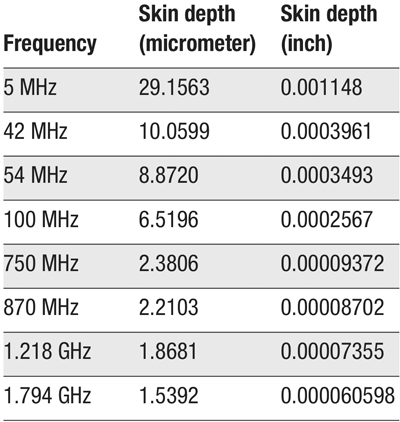

# Maximizing Q

1. [Background note](#background-note)
2. [Enamel coated wire](#enamel-coated-wire)
2. [Silver plated wire](#silver-plated-wire)

## Background note

For most practical applications, chasing a higher value of Q for your coils
is not worth the effort.

Very high Q RF coils are apparently impossible: some experimenters with excellent setups have
suggested that the maximum Q you can achieve physically is about 1000. (Compare with 50,000
Q variable capacitors available for purchase.) Just about anything – including the presence
of conductive material anywhere in the vicinity of the coil – will tamp down a high Q.

A Q of 200 is a reasonable goal, and 800 might be doable in special circumstances.

## Enamel coated wire

As shown in the table, coil current at RF passes through a thin surface layer of the conductor.

Copper will oxidize, leaving a mostly non-conductive outer layer in your winding, which acts
as a resistance due to the skin effect and will dissipate power. Therefore, coils wound using
coated wire (usually enamel) to prevent oxidation will have better efficiency than coils made
of bare wire.

## Silver plated wires

Material | Conductivity
--|--
Silver 	| 6.30x107 S/m
Copper 	| 5.98x107 S/m

Silver is more conductive than copper... by about 5%.

At RF frequencies the skin effect forces the current to flow on the surface of a conductor,
and for a plated conductor all of the current will flow within the plating thickness.

Since silver has a higher conductivity than copper, you can get a small performance boost
from using silver plated wire.

Some power RF coils use silver plated wire to reduce power dissipation, but in most cases
the higher efficiency is not worth the effort or expense.
