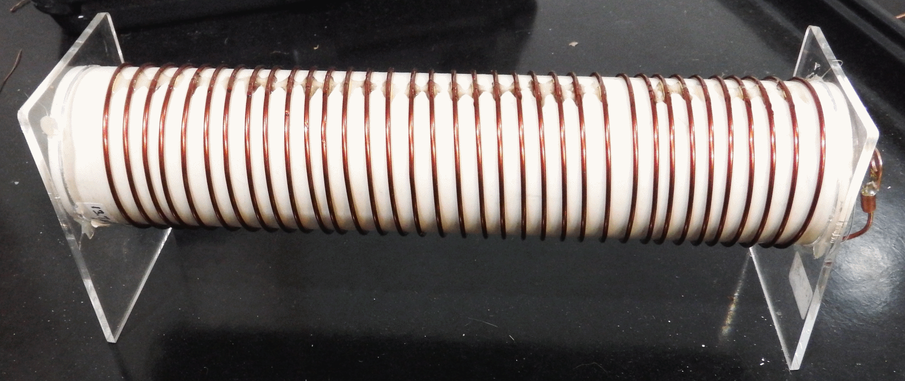
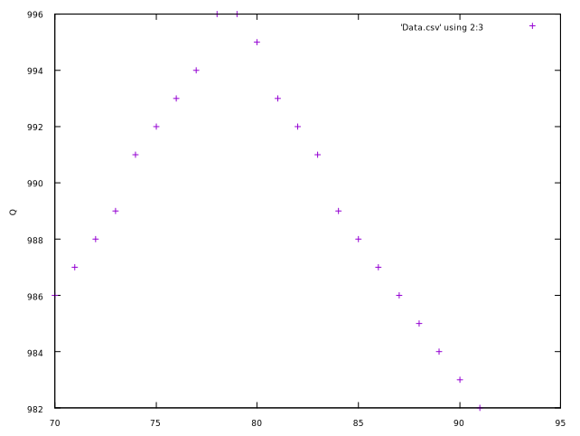
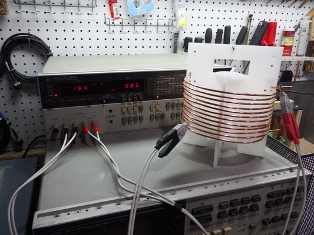

# Quickstart 

1. [Characterize existing coils](#characterize-existing-coils)
2. [Making coils on existing forms](#making-coils-on-existing-forms)
3. [Silver plated wire](#silver-plated-wire)
4. [Making highly optimized coils](#highly-optimized-coils)

## Characterize existing coils



Suppose you purchased the coil shown above at a hamfest and would like to know
its inductance at 13.56 MHz. You measure the diameter as 50 mm, the length is 200 mm,
and there are 35 turns.

Use CoilCalc to identify and characterize the coil.


````
> CoilCalc --D=50 --l=200 --N=35 --d=1.44 --f=13.562

# QOIL™ — https://hamwaves.com/qoil/ — v20181217
#   Coil design 2023-03-11 12:20
# 
INPUT
#   mean diameter of the coil    D = 50.0 mm
#   number of turns              N = 35.0
#   length of the coil           ℓ = 200.0 mm
#   wire or tubing diameter      d = 1.44 mm
#   design frequency             f = 13.562 MHz
#   The (plating) material is annealed copper.
# 
INTERMEDIATE RESULTS
#   winding pitch                p = 5.71 mm
#   physical conductor length    ℓ_w_phys = 5501.4 mm
#   effective pitch angle        ψ = 2.09°
# 
RESULTS
#   Effective equivalent circuit
#     effective series inductance @ design frequency          L_eff_s = 16.652 μH
#     effective series reactance @ design frequency           X_eff_s = 1419.0 Ω
#     effective series AC resistance @ design frequency       R_eff_s = 1.438 Ω
#     effective unloaded quality factor @ design frequency    Q_eff   = 986
#   Lumped circuit equivalent
#     f-independent series inductance; geometrical formula    L_s     = 14.105 μH
#     series AC resistance @ design frequency                 R_s     = 1.032 Ω
#     parallel stray capacitance @ design frequency           C_p     = 1.5 pF
#   Self-resonant frequency                                   f_res   = 26.342 MHz
# 
DONATE
#   If this calculator proved any useful to you,
#   please, consider making a one-off donation
#   towards keeping me and the server up and running.
#   Thank you!
````

At 13.56 MHz the coil will have an effective inductance of 16.6 uH and the
self-resonant frequency is high enough for the coil to be used in that
frequency band.

The calculated Q is almost 1000, which is pretty good for a hand-wound coil,
but note that it is physically impossible to make coils with this
level of quality.

The high calculated Q probably translates into a reasonably high Q
for a hand-wound coil of 200 to 400, which is still pretty good.

## Making coils on existing forms

Suppose you have an existing coil form, a piece of 2" PVC pipe, and would like
to make a coil similar to the one shown above. You know the form and wire diameter,
you need a 12 uH inductance, and you are willing to use any length and number
of turns.

You would like a coil with the highest possible Q.

Use CoilScanL to scan all possible coil lengths, and for each length
interpolate the number of turns needed for an inductance of 12 uH, and
show the parameters for each coil.

````
> CoilScanL --LTarget=12 --DForm=48 --lMin=20 --lMax=250 --lInc=10 --d=1.44 --f=13.562

# CoilScan 2023-03-11 13:21
#
# LTarget = 12, d = 1.44, p = 6, f = 13.562
#
# DForm =  48, lMin  =  20, lMax = 250, lInc =  10
#
# D(mm),   l(mm), Q(plot),      Q,       N,    L(uH), wLen(m), Res(MHz), pitch(mm), Err, Cmd
  49.44,   30.00,     621,     621   16.77,    12.00,     2.61,    34.32,      1.79,   0, "CoilCalc --D=49.440 --l=30.000 --N=16.770 --d=1.440 --f=13.562"
  49.44,   40.00,     843,     843   17.89,    12.00,     2.78,    34.44,      2.24,   0, "CoilCalc --D=49.440 --l=40.000 --N=17.890 --d=1.440 --f=13.562"
  49.44,   50.00,     947,     947   18.98,    12.00,     2.95,    34.40,      2.63,   0, "CoilCalc --D=49.440 --l=50.000 --N=18.980 --d=1.440 --f=13.562"
  49.44,   60.00,     981,     981   20.03,    12.00,     3.11,    34.26,      2.99,   0, "CoilCalc --D=49.440 --l=60.000 --N=20.030 --d=1.440 --f=13.562"
  49.44,   70.00,     986,     986   21.03,    12.00,     3.27,    34.05,      3.33,   0, "CoilCalc --D=49.440 --l=70.000 --N=21.030 --d=1.440 --f=13.562"
  49.44,   80.00,     995,     995   21.98,    12.00,     3.41,    33.79,      3.64,   0, "CoilCalc --D=49.440 --l=80.000 --N=21.980 --d=1.440 --f=13.562"
  49.44,   90.00,     983,     983   22.87,    12.00,     3.55,    33.52,      3.93,   0, "CoilCalc --D=49.440 --l=90.000 --N=22.870 --d=1.440 --f=13.562"
  49.44,  100.00,     974,     974   23.72,    12.00,     3.69,    33.23,      4.22,   0, "CoilCalc --D=49.440 --l=100.000 --N=23.720 --d=1.440 --f=13.562"
  49.44,  110.00,     972,     972   24.53,    12.00,     3.81,    32.94,      4.48,   0, "CoilCalc --D=49.440 --l=110.000 --N=24.530 --d=1.440 --f=13.562"
  49.44,  120.00,     972,     972   25.31,    12.00,     3.93,    32.65,      4.74,   0, "CoilCalc --D=49.440 --l=120.000 --N=25.310 --d=1.440 --f=13.562"
  49.44,  130.00,     957,     957   26.05,    12.00,     4.05,    32.37,      4.99,   0, "CoilCalc --D=49.440 --l=130.000 --N=26.050 --d=1.440 --f=13.562"
  49.44,  140.00,     939,     939   26.76,    12.00,     4.16,    32.09,      5.23,   0, "CoilCalc --D=49.440 --l=140.000 --N=26.760 --d=1.440 --f=13.562"
  49.44,  150.00,     923,     923   27.45,    12.00,     4.27,    31.82,      5.46,   0, "CoilCalc --D=49.440 --l=150.000 --N=27.450 --d=1.440 --f=13.562"
  49.44,  160.00,     909,     909   28.11,    12.00,     4.37,    31.56,      5.69,   0, "CoilCalc --D=49.440 --l=160.000 --N=28.110 --d=1.440 --f=13.562"
  49.44,  170.00,     897,     897   28.74,    12.00,     4.47,    31.30,      5.91,   0, "CoilCalc --D=49.440 --l=170.000 --N=28.740 --d=1.440 --f=13.562"
  49.44,  180.00,     886,     886   29.35,    12.00,     4.56,    31.06,      6.13,   0, "CoilCalc --D=49.440 --l=180.000 --N=29.350 --d=1.440 --f=13.562"
  49.44,  190.00,     876,     876   29.94,    12.00,     4.65,    30.82,      6.35,   0, "CoilCalc --D=49.440 --l=190.000 --N=29.940 --d=1.440 --f=13.562"
````

This looks good, so save the output to a CSV data file and display using Gnuplot.

````
> CoilScanL --LTarget=12 --DForm=48 --lMin=20 --lMax=250 --lInc=10 --d=1.44 --f=13.562 >Data.csv
> gnuplot LPlot.gp
````


Maximum Q occurs with an 80 mm coil. Consulting the data file we see that at that length the calculated
Q is 995, the inductance is 12 uH as expected, and the resonant frequency is 33.75 MHZ. The coil
has 22 turns.

Now that we know the maximum Q happens somewhere between 70 and 90, we can rerun the calculations for a
more exact answer:

````
> CoilScanL --LTarget=12 --DForm=48 --lMin=70 --lMax=90 --lInc=1 --d=1.44 --f=13.562 >Data.csv
> gnuplot LPlot.gp
````



A length of 78 or 79 mm gives us the highest Q, but we would need to be accurate to 1/4 of
a turn. A lengh ot 80 mm with 22 turns is more reasonable.

## Silver plated wire

Would the coil benefit from using silver-plated wire? Specify the p ("wire plating") parameter
to find out.


````
> CoilScanL --help

Usage: 

    CoilScanL --LTarget=<ind-uH>  --DForm=<form-dia-mm>                    \
              --lMin=<min-len-mm> --lMax=<max-len-mm> --lInc=<inc-len-mm>  \
              --d=<wire-dia-mm>   --f=<freq-mhz> \
             [--LenMM] [--LenFt] [--p=<plating-index>]

Where:

    --LTarget=<ind-uH>       Target inductance in uH
    --DForm=<form-dia-mm>    Form diameter, in mm

    --lMin=<coil-len-mm>     Min coil length to scan, in mm
    --lMax=<coil-len-mm>     Max coil length to scan, in mm
    --lInc=<coil-len-mm>     Coil length increment  , in mm

    --d=<wire-dia-mm>        Wire diameter, in mm
    --d=<some-number>AWG     Wire specified as AWG
    --f=<freq-mhz>           Frequency of interest

    --p=<plating-index>      (OPTIONAL) Wire plating
             =0                  annealed copper (DEFAULT)
             =1                  hard-drawn copper
             =2                  silver
             =3                  aluminium

    --LenM                   (OPTIONAL) Print conductor length in meters
    --LenFt                  (OPTIONAL) Print conductor length in feet

    --help                   Print this message and exit

> CoilCalc --D=49.440 --l=80.000 --N=21.980 --d=1.440 --f=13.562 --p=2

# QOIL™ — https://hamwaves.com/qoil/ — v20181217
#   Coil design 2023-03-11 13:35
# 
INPUT
#   mean diameter of the coil    D = 49.44 mm
#   number of turns              N = 21.98
#   length of the coil           ℓ = 80.0 mm
#   wire or tubing diameter      d = 1.44 mm
#   design frequency             f = 13.562 MHz
#   The (plating) material is silver.
# 
INTERMEDIATE RESULTS
#   winding pitch                p = 3.64 mm
#   physical conductor length    ℓ_w_phys = 3414.9 mm
#   effective pitch angle        ψ = 1.35°
# 
RESULTS
#   Effective equivalent circuit
#     effective series inductance @ design frequency          L_eff_s = 12.006 μH
#     effective series reactance @ design frequency           X_eff_s = 1023.1 Ω
#     effective series AC resistance @ design frequency       R_eff_s = 0.986 Ω
#     effective unloaded quality factor @ design frequency    Q_eff   = 1037
#   Lumped circuit equivalent
#     f-independent series inductance; geometrical formula    L_s     = 11.358 μH
#     series AC resistance @ design frequency                 R_s     = 0.883 Ω
#     parallel stray capacitance @ design frequency           C_p     = 0.7 pF
#   Self-resonant frequency                                   f_res   = 33.786 MHz
# 
DONATE
#   If this calculator proved any useful to you,
#   please, consider making a one-off donation
#   towards keeping me and the server up and running.
#   Thank you!
````

For the coil as designed, using silver plated wire would change the inductance by a
negligible amount, but the Q would go up by about 4% (to 1037 from 995).

For most practical purposes, this increase of efficiency is not worth the expense,
but if you are designing a high-power system, an inductive heating coil for example,
you might want the extra efficiency.

With aluminum wire, the Q drops by almost a quarter (from 995 to 775)! Definitely
make the coil out of copper and not aluminum!

## Highly optimized coils

Suppose you want to make a power coil with an off-the-chart efficiency (the
author's actual goal for the project).

You know the inductance needed, you know how thick your wire is, and you can design
a bespoke coil form of any size and length.

Setting some reasonable boundaries, you decide the coil form diameter can
range from 20 mm to 300 mm, the length from 20 mm to 300 mm, and you want an inductance
of 26 uH to match the corresponding capacitor at 13.56 MHz.

````
> CoilScanDL --LTarget=26 DMin=20 DMax=280 DInc=5 lMin=20 lMax=300 lInc=5 --d=1.291, --f=13.562

# CoilScan 2023-03-11 14:00
#
# LTarget = 26, d = 6.35, p = 6, f = 13.562
#
# DMin =  20, DMax = 280, DInc =   5
# lMin =  20, lMax = 300, lInc =   5
#
# D(mm),   l(mm), Q(plot),      Q,       N,    L(uH), wLen(ft), Res(MHz), pitch(mm), Err, Cmd
  60.00,  280.00,    1939,    1939   41.73,    26.00,    25.82,    20.13,      6.71,   0, "CoilCalc --D=60.000 --l=280.000 --N=41.730 --d=6.350 --f=13.562"
  60.00,  285.00,    1965,    1965   41.95,    26.00,    25.96,    20.08,      6.79,   0, "CoilCalc --D=60.000 --l=285.000 --N=41.950 --d=6.350 --f=13.562"
  60.00,  290.00,    1991,    1991   42.17,    26.00,    26.09,    20.04,      6.88,   0, "CoilCalc --D=60.000 --l=290.000 --N=42.170 --d=6.350 --f=13.562"
  60.00,  295.00,    2018,    2018   42.38,    26.00,    26.23,    19.99,      6.96,   0, "CoilCalc --D=60.000 --l=295.000 --N=42.380 --d=6.350 --f=13.562"
  60.00,  300.00,    2045,    2045   42.59,    26.00,    26.36,    19.95,      7.04,   0, "CoilCalc --D=60.000 --l=300.000 --N=42.590 --d=6.350 --f=13.562"
  60.00,  305.00,    2063,    2063   42.81,    26.00,    26.49,    19.91,      7.13,   0, "CoilCalc --D=60.000 --l=305.000 --N=42.810 --d=6.350 --f=13.562"
  65.00,  245.00,    1974,    1974   36.56,    26.00,    24.51,    20.16,      6.70,   0, "CoilCalc --D=65.000 --l=245.000 --N=36.560 --d=6.350 --f=13.562"
  65.00,  250.00,    2012,    2012   36.78,    26.00,    24.65,    20.11,      6.80,   0, "CoilCalc --D=65.000 --l=250.000 --N=36.780 --d=6.350 --f=13.562"
    :       :          :
^C

> CoilScanDL --LTarget=26 DMin=20 DMax=280 DInc=5 lMin=20 lMax=300 lInc=5 --d=1.291, --f=13.562 >Data.csv
> gnuplot DLPlot.gp

````

We see that maximum Q around 7000 (calculated) happens with a coil diameter of 260 mm and
a length of 90 mm - a short, squat coil.

The calculated Q (7000) is not achievable phusically: at that level of
Q even the tiniest of perturbations will have a massive negative effect on the Q.

Still, the design indicates that the most efficient coils are found at large diameters
with reasonable lengths and the indicated coil would make a good starting point for
development.



