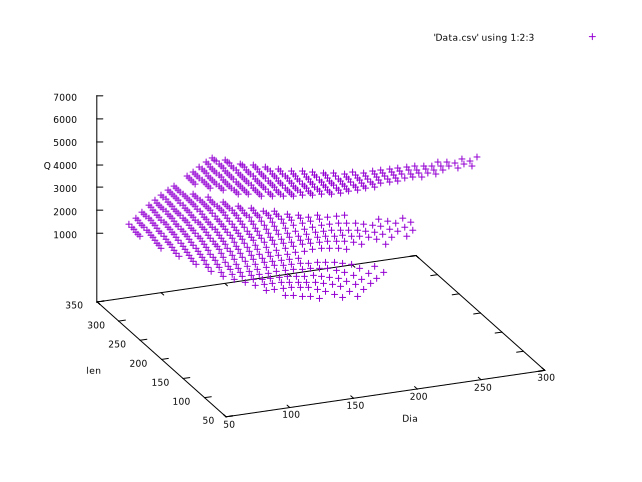

# Inductance Calculator

Python programs to make coil design easier.

1. [Background](#background)
2. [This project](#this-project)
3. [Usage](#usage)
4. [Plotting the results](#plotting-the-results)


## Background


The typical coil formula for inductance (the one you find on Wikipedia) is only accurate
for audio frequencies, it tops out at about 100 KHz.

At RF frequencies, a handful of competing issues come into play,
that are negligible at lower frequencies, to make your coil a different actual value.
Most inductance measuring devices work at 10 KHz or 100 KHz and track the geometric formula
shown above, so the engineer has no reason to believe the coil is not as designed.

For example, at higher frequencies the reactance from the inter-winding capacitance
becomes non-negligible and subtracts from the inductive reactance. The capacitive reactance
gets larger with higher frequencies, and at a high enough frequency the capacitive reactance
equals the inductive reactance and you have a self-resonant single component (with no
inductance).

Furthermore the geometric formula says nothing about the Q of a coil, so that designing
an efficient coil with high Q is a complicated matter.

## This project

The complete formula for coil parameters is presented on 
[Serge Stroobandt's web page](https://hamwaves.com/inductance/en/index.html)
and takes everything into consideration, including frequency and wire plating.

This project contains the math behind that web site converted to a javascript
library for calculation, and some additional functions to scan across coil
parameters and print the values that would be shown from Serge's site.

Using a simple program loop and your initial design parameters, you can scan through
different coil designs to maximize a parameter for your project.

For example, suppose you need a 25 uH coil with high Q. You can specify a wire diameter
and coil value, then scan through all possible widths and lengths of coil: the program
will interpolate the number of turns needed to achieve the inductance at the width and
length, then print out the Q (and other information) for that coil. From this you can
choose a design with a high calculated Q value.

You can do the same operation to optimize a coil for shortest wire, or smallest
total volume, or whatever the designer needs.

## Usage

All programs accept the --help option to show their parameters.

Use:

* CoilCalc: to calculate and print the parameters of a known coil
* CoilScanL: Given a specific inductance, scan all possible coil
lengths, and for each length interpolate the number of turns needed
for that inductance
* CoulScanDL: Given a specific inductance, scan through all possible
coil lengths and diameters, and for each length/diameter pair calculate
the number of turns needed for that inductance.

See [Quickstart](QuickStart.md) for an introduction on using the programs.

See [Library](Library.md) for writing your own programs.

See [MaximizingQ](MaximizingQ.md) for notes on maximizing coil Q performance.


## Plotting the results

Generated CSV files can be directly plotted with Gnuplot, to easily see
trends and maxima/minima in the data.

````
gnuplot                 # Start gnuplot
> set xlabel "Dia"
> set ylabel "len"
> set zlabel "Q";  splot 'Data.csv' using 1:2:3         # Q is column 3
> set zlabel "C";  splot 'Data.csv' using 1:2:7         # C is column 7
> set zlabel "Ft"; splot 'Data.csv' using 1:2:8         # Wire len is column 8
````

The project contains a couple of gnuplot files (extension ".gp") to get you started. To
run these:

````
> CoilScanL ...  >Data.csv          # Generate results, save as .CSV file
> gnuplot DLPlot.gp                 # Plot the results
````



