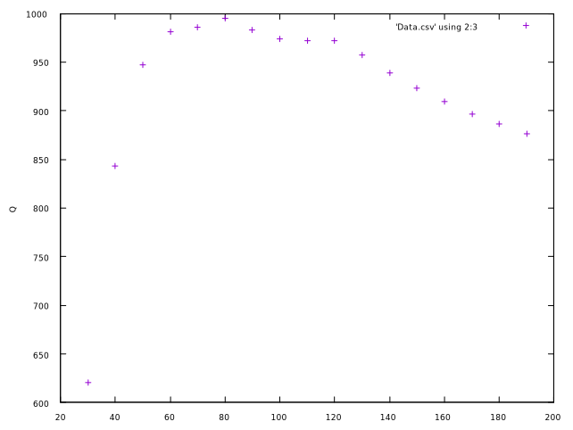

# Inductance Calculator

A python library for scanning through coil parameters.

1. [Background](#background)
2. [This project](#this-project)
3. [Usage](#usage)
4. [Plotting the results](#plotting-the-results)
5. [A note on maximizing Q](#a-note-on-maximizing-q)
6. [Coated coil wires](#coated-coil-wires)
7. [Silver plated wires](#silver-plated-wires)


## Background


The typical coil formula for inductance (the one you find on Wikipedia) is only accurate
for audio frequencies, it tops out at about 100 KHz.

At RF frequencies, a handful of competing issues come into play,
that are negligible at lower frequencies, to make your coil a different actual value.
Most inductance measuring devices work at 10 KHz or 100 KHz and track the geometric formula
shown above, so the engineer has no reason to believe the coil is not as designed.

For example, at higher frequencies the reactance from the inter-winding capacitance
becomes non-negligible and subtracts from the inductive reactance. The capacitive reactance
gets larger with higher frequencies, and at a high enough frequency the capacitive reactance
equals the inductive reactance and you have a self-resonant single component (with no
inductance).

Furthermore the geometric formula says nothing about the Q of a coil, so that designing
an efficient coil with high Q is a complicated matter.

## This project

The complete formula for coil parameters is presented on 
[Serge Stroobandt's web page](https://hamwaves.com/inductance/en/index.html)
and takes everything into consideration, including frequency and wire plating.

This project contains the math behind that web site converted to a javascript
library for calculation, and some additional functions to scan across coil
parameters and print the values that would be shown from Serge's site.

Using a simple program loop and your initial design parameters, you can scan through
different coil designs to maximize a parameter for your project.

For example, suppose you need a 25 uH coil with high Q. You can specify a wire diameter
and coil value, then scan through all possible widths and lengths of coil: the program
will interpolate the number of turns needed to achieve the inductance at the width and
length, then print out the Q (and other information) for that coil. From this you can
choose a design with a high calculated Q value.

You can do the same operation to choose a coil with shortest wire, or the smallest
total volume, or whatever the designer needs.

## Usage

See [Quickstart](Quickstart.md) for an introduction on using the programs.

See [Library](Library.md) for writing your own programs.

The 

## Plotting the results

Generated CSV files can be directly plotted with Gnuplot, making it possible to see
trends and maxima/minima in the data.

````
gnuplot                 # Start gnuplot
> set xlabel "Dia"
> set ylabel "len"
> set zlabel "Q";  splot 'Data.csv' using 1:2:3         # Q is column 3
> set zlabel "C";  splot 'Data.csv' using 1:2:7         # C is column 7
> set zlabel "Ft"; splot 'Data.csv' using 1:2:8         # Wire len is column 8
````

The project contains a couple of gnuplot files (extension ".gp") to get you started. To
run these:

````
> CoilScanL ...  >Data.csv          # Generate results, save as .CSV file
> gnuplot DLPlot.gp                 # Plot the results
````



## A note on maximizing Q

Very high Q RF coils are apparently impossible: some experimenters with excellent setups have
suggested that the maximum Q you can achieve physically is about 1000. (Compare with 50,000
Q variable capacitors available for purchase). Just about anything – including the presence
of conductive material anywhere in the vicinity of the coil – will tamp down a high Q.

A Q of 200 is a reasonable goal, and 800 might be doable in special circumstances.

## Coated coil wires


As shown in the table, coil current at RF passes through a thin surface layer of the conductor.

Copper will oxidize, leaving a mostly non-conductive outer layer in your winding, which acts
as a resistance due to the skin effect and will dissipate power.

Coils wound using coated wire (usually enamel) to prevent oxidation will have
better efficiency than coils made of bare wire.

## Silver plated wires

Material | Conductivity
--|--
Silver 	| 6.30x10<sup>7</sup> S/m
Copper 	| 5.98x10<sup>7</sup> S/m

Silver is more conductive than copper... by about 5%.

At RF frequencies the skin effect forces the current to flow on the surface of a conductor,
and for a plated conductor all of the current will flow within the plating thickness.

Since silver has a higher conductivity than copper, you can get a small performance boost
from using silver plated wire.

Some power RF coils use silver plated wire to reduce power dissipation, but in most cases
the higher efficiency is not worth the effort or expense.
